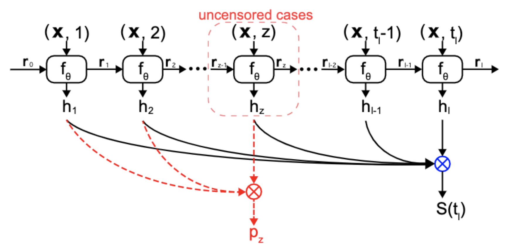
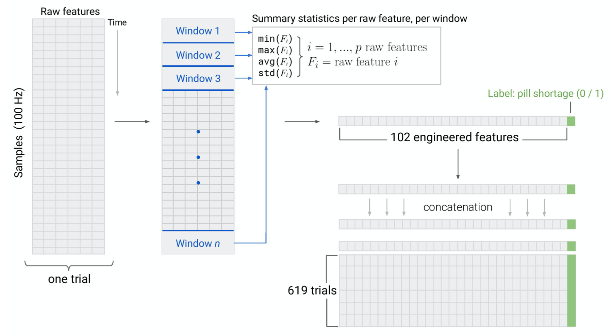
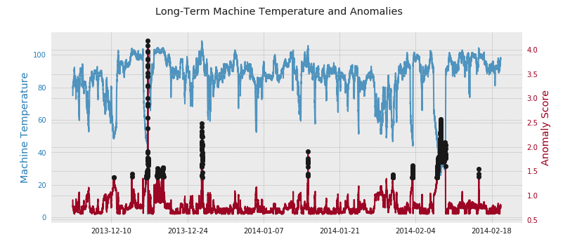
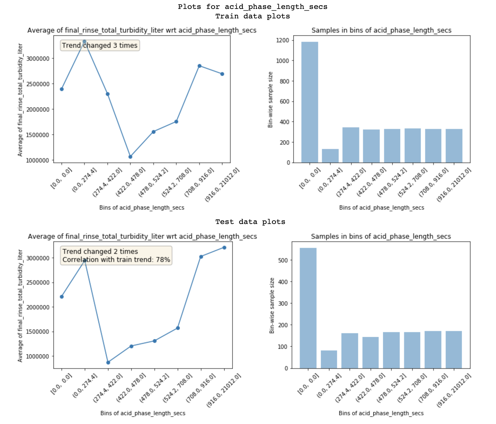
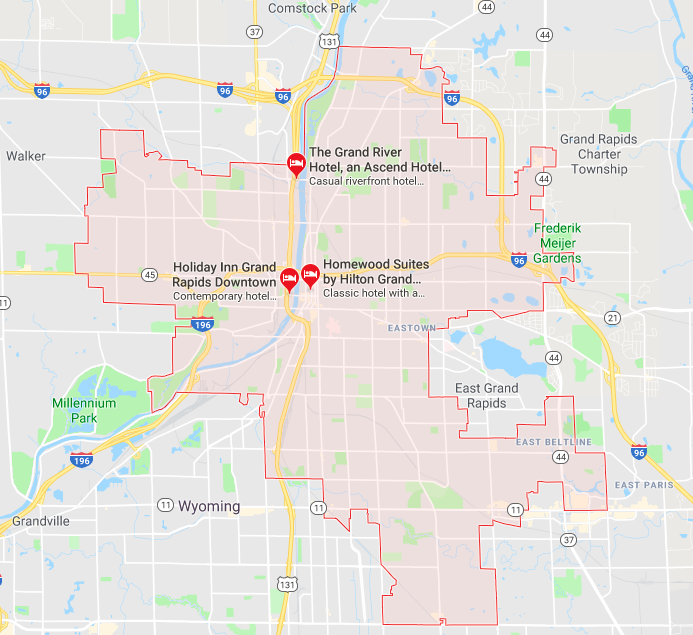

# [Deep, Recurrent Survival Analysis in PyTorch](https://github.com/collinprather/drsa)

An adapted PyTorch implementation (see [docs](https://collinprather.github.io/drsa/) for details) of a Deep Recurrent Survival Analysis model. The image above, and network architecture come directly from the [original paper](https://arxiv.org/pdf/1809.02403.pdf). 

---

# [_Sparkle_: A Multi-Platform System for Combating Medication Non-adherence with Machine Learning](https://github.com/msarmi9/sparkle)

Our paper, _“​A Machine Learning Approach to Detecting Low Medication State with Wearable Technologies”_ was accepted for presentation at the [IEEE Engineering in Medicine and Biology Society Conference 2020](https://embc.embs.org/2020/), in Montréal, Québec, Canada.

---

# [Anomaly Detection with AWS Inference Pipeline](https://github.com/collinprather/anomaly-detection-aws-ip)

---

# [DrivenData Turbidity Competition](https://github.com/collinprather/drivendata-turbidity-analysis)

---

# [Grand Rapids Car Crash Analysis](https://github.com/collinprather/Grand-Rapids-Car-Crash-Analysis)
