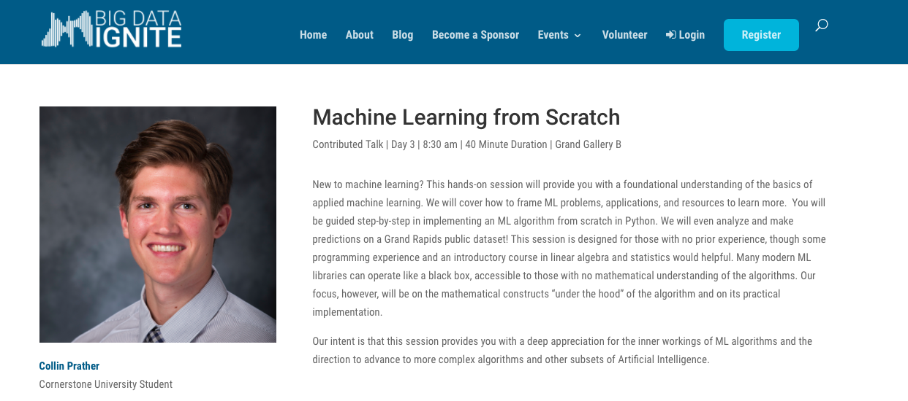
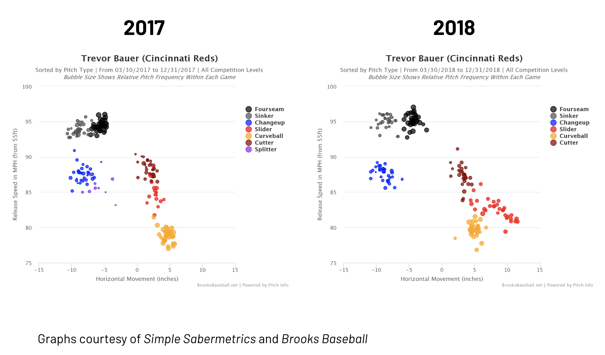
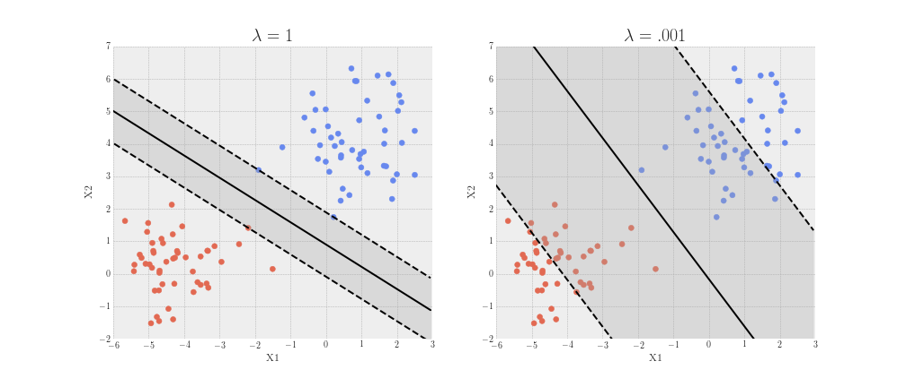

# [Machine Learning from Scratch](https://github.com/collinprather/BDI-2018-JupyterHub)

*September 2018*, 40 mins, at the [Big Data Ignite Conference](https://bigdataignite.org)

I had a blast speaking at the Big Data Ignite 2018 conference. This talk dove into the math that powers machine learning. 

---

# [Deep learning for baseball card classification](https://github.com/collinprather/BambinoNet-presentation)

*April 2019*, 40 mins, at Cornerstone University

Using transfer learning to teach [Keras' MobileNetV2](https://keras.io/applications/#mobilenetv2) to differentiate between Red Sox and Yankees baseball cards. 
I affectionately named the model "BambinoNet", after [the Great Bambino](https://en.wikipedia.org/wiki/Babe_Ruth).

---

# [MoneyBall is Dead](https://medium.com/usf-msds/practicum-pride-msds-students-present-at-data-science-beer-and-sports-14ee5c387ec0)

*Feb 2020*, 15 mins, at [Standard Deviant](https://standarddeviantbrewing.com/)

For [SF's Beer Week](https://sfbeerweek.org/) 2020, I gave a talk titled, “MoneyBall is Dead: Why Player Development is the Final Frontier for Baseball Analytics”. 
This included a high-level overview of what data analysis in MLB organizations has looked like since the turn of the century and why the adoption of new high-frequency data collection devices, like high-speed cameras and radar, is changing how the game of baseball is played.

---

# [Machine Learning Overview](https://github.com/collinprather/ML-overview/tree/master)

*February 2019*, 60 mins, at [SpinDance](https://spindance.com)

A wide overview of the field of Machine Learning. 
Intended to leave you fluent enough in machine learning concepts and lingo to develop 
some intuition into what problems could be solved using machine learning, where it 
could be integrated into our current projects, and give you some direction if you 
decide that you'd like to learn more.

---

# [Machine Learning for Developers](https://github.com/collinprather/ML-for-developers/tree/master)

*May 2019*, 60 mins, at [SpinDance](https://spindance.com)

A technical talk walking through the steps in the ML pipeline and how developers can integrate and deploy ML solutions into their applications
